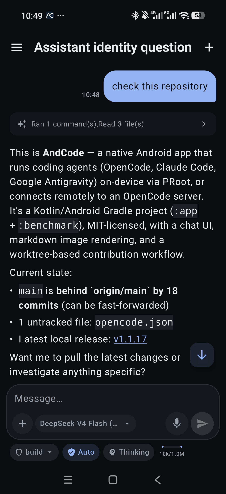
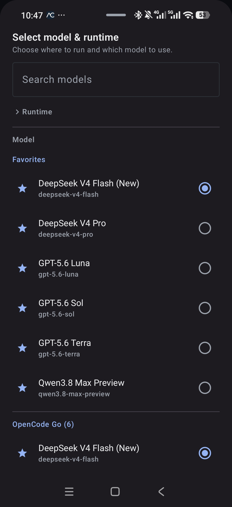

# AndCode

<p align="center">
  <a href="https://github.com/yuga-hashimoto/and-code/actions/workflows/android.yml"></a>
  <a href="https://github.com/yuga-hashimoto/and-code/releases/latest"></a>
  <a href="LICENSE"></a>
  <a href="https://github.com/yuga-hashimoto/and-code/releases/latest"></a>
</p>

**Run coding agents locally on Android through a native GUI — no terminal required.**

AndCode is a native Android GUI app that brings AI coding agents to your phone. Chat with [OpenCode](https://github.com/sst/opencode), [Claude Code](https://github.com/anthropics/claude-code), and [Google Antigravity](https://github.com/google-antigravity/antigravity-cli) through a touch-first interface — no terminal, no SSH, no PC required for on-device use. It wraps agent runtimes via PRoot (on-device) or connects remotely to your existing OpenCode server on PC/Mac/Linux.

<p align="center">
  
  &nbsp;
  
  &nbsp;
  
</p>

> [!IMPORTANT]
> AndCode is an independent open-source project. It is **not** affiliated with OpenCode or Anthropic.

[日本語のREADMEはこちら](README.ja.md)

---

## Supported Agents

| Agent | On-Device | Remote PC | Status |
|-------|:---------:|:---------:|--------|
| [OpenCode](https://github.com/sst/opencode) | ✓ | ✓ | Stable |
| [Claude Code](https://github.com/anthropics/claude-code) | ✓ | — | Beta |
| [Google Antigravity](https://github.com/google-antigravity/antigravity-cli) | ✓ | — | Beta |

On-device agents run inside an Alpine Linux environment via PRoot. Google Antigravity additionally installs a Debian Bookworm rootfs alongside Alpine, since the official `agy` binary links against glibc.

## Features

- **Native Android GUI** — Touch-first interface for coding agents; no CLI or terminal required
- **On-device runtime** — Alpine Linux, Git, bash, curl, ripgrep, and coding agents auto-installed on your Android device via PRoot
- **Repository & workspace** — Open and work within git repositories on-device
- **Device files** — Grant all-files access and the whole phone (`/sdcard`, SD cards, USB drives) becomes browsable in the folder picker and reachable by the agent, opened in place instead of copied into the app
- **Git support** — Stage, diff, commit, and manage branches from the GUI
- **Diff viewer** — Review code changes inline before accepting
- **Pull request badges** — Pull requests opened in a chat stay pinned above the composer with their diff size and state (draft, open, conflict, merged, closed); tap to open them on GitHub
- **Tool approvals** — Approve or reject dangerous tool operations
- **Session management** — Create, resume, rename, and delete sessions
- **Dynamic models** — Models, providers, and agents fetched live from your connected agent instance
- **Real-time streaming** — SSE-based live responses, tool execution, and approval requests
- **Structured timeline** — Collapsible reasoning, tool calls, and command output
- **Voice + Wake Word** — Push-to-talk with Android speech recognition + wake word detection
- **Text-to-speech** — Read responses aloud
- **Digital assistant** — Register as Android's default assistant (home gesture / corner swipe)
- **Secure storage** — Connection credentials encrypted with Android Keystore
- **Localized UI** — English, Japanese, Chinese (Simplified), Russian, Spanish, French, Portuguese (Brazil), and Arabic, switchable from Settings

## Antigravity

Google Antigravity (`agy`) runs on-device inside the same PRoot environment. Unlike OpenCode and Claude Code which run in Alpine Linux, Antigravity uses a Debian Bookworm rootfs for glibc compatibility with the official CLI binary.

- **OAuth sign-in** — Authenticate via the browser URL + one-time code flow; credentials are stored only in the Linux rootfs (`~/.gemini`), never in Android preferences
- **Model selection** — Live model catalog fetched from the signed-in `agy` instance (Gemini, Claude, GPT-OSS variants)
- **Permission modes** — Three-tier control: Plan, Accept Edits, and Full Access (`--dangerously-skip-permissions`)
- **MCP servers** — Read/write `~/.gemini/config/mcp_config.json` directly, matching the official CLI's config format
- **Sandbox launcher** — PTY-based process with explicit terminal geometry; `AGY_CLI_DISABLE_AUTO_UPDATE=1` keeps updates app-controlled

## Remote OpenCode

In addition to on-device agents, AndCode can connect to OpenCode running on your PC/Mac/Linux as an additional feature:

- **Remote connection** — Connect over LAN or Tailscale
- **Runtime switching** — Seamlessly switch between local and remote execution, even mid-conversation (handoff)
- **Discovery** — Find PCs via QR code or mDNS (zero-config LAN discovery)

## Screens

| Screen | Description |
|--------|-------------|
| Home | Current runtime, model, agent, recent sessions |
| Chat | Conversation with collapsible reasoning/tools, voice input, model switching, approvals, handoff |
| Workspaces | Local runtime, PC connections, working folders |
| History | Running tasks, pending approvals, sessions, event log |
| Settings | Home assistant, TTS, continuous conversation, configuration |

## Quick Start

### Option A: On-Device (no PC needed)

1. Install the APK from [Releases](https://github.com/yuga-hashimoto/and-code/releases/latest)
2. Open the app → tap **Workspaces** → **This Android device** → **Set up on this device**
3. Wait for the runtime to download and install (~2 min on a good connection)
4. Select your coding agent and start chatting

### Option B: Remote PC

1. Start OpenCode on your PC:

```bash
OPENCODE_SERVER_PASSWORD='your-strong-password' \
  opencode serve --hostname 0.0.0.0 --port 4096 --mdns
```

2. Install the APK on your Android device
3. Open the app → **Workspaces** → **Add connection**
4. Enter your PC's IP (or use **LAN search** / **QR code** for auto-discovery)

```text
Name:     Mac mini
URL:      http://192.168.1.10:4096
Username: opencode
Password: your-strong-password
```

> Tailscale works too: `http://100.x.y.z:4096` or `http://your-mac.tailnet-name.ts.net:4096`

### QR Code Setup

Generate a QR code on your PC:

```bash
npx qrcode "opencode://connect?name=Mac%20mini&url=http%3A%2F%2F192.168.1.10%3A4096&username=opencode&password=your-password&insecure=true"
```

Then scan it from **Workspaces** → **Add via QR** in the app.

## Security

- **Never** expose port 4096 directly to the internet
- Use LAN or Tailscale for connectivity
- Use an HTTPS reverse proxy on public networks
- The app never auto-approves dangerous operations
- Plaintext HTTP on LAN requires explicit per-connection opt-in

## On-Device Runtime Details

The setup process (triggered from Workspaces):

1. Verifies the native PRoot runner bundled in the APK
2. Downloads Alpine Linux minirootfs from the official CDN
3. Downloads the agent binary from GitHub Releases
4. Validates SHA-256 checksums for both
5. Extracts to a private app directory
6. Installs Git, bash, curl, ripgrep, and CA certificates inside Alpine
7. Starts the agent server on `127.0.0.1:4097`
8. Switches the app to the local runtime

Pinned versions (updatable via app releases without agent changes):

- Alpine Linux 3.24.1
- OpenCode 1.18.3
- Google Antigravity CLI 1.1.7 (Debian Bookworm rootfs)
- Architectures: arm64-v8a, x86_64

## Handoff (Runtime Switching Mid-Conversation)

From the chat header menu → **Continue on another runtime** — the app generates a conversation summary prompt and sends it to the selected runtime, letting you pick up where you left off (e.g., start on-device while commuting, continue on your PC at home).

## Connecting to OpenCode Desktop

Add server config to `~/.config/opencode/opencode.json`:

```json
{
  "server": {
    "port": 4096,
    "hostname": "0.0.0.0",
    "mdns": true
  }
}
```

Restart the desktop app, then discover it from the Android app via **LAN search**.

## Building from Source

Requirements: JDK 17, Android SDK, Python 3, network access (first build only)

```bash
./gradlew testDebugUnitTest lintDebug assembleDebug assembleRelease
```

Output APKs:

```text
app/build/outputs/apk/debug/app-debug.apk
app/build/outputs/apk/release/app-release-unsigned.apk
```

Install to device:

```bash
adb install -r app/build/outputs/apk/debug/app-debug.apk
```

## Contributing

Contributions are welcome! Please see [CONTRIBUTING.md](CONTRIBUTING.md) for guidelines.

## Design Documents

- [AndCode v2 Design](docs/superpowers/specs/2026-07-18-opencode-android-v2-design.md)
- [Antigravity Agent Parity Design](docs/superpowers/specs/2026-07-27-antigravity-agent-parity-design.md)
- [Initial MVP Plan](docs/superpowers/plans/2026-07-18-initial-mvp.md)
- [Local Runtime Design](docs/LOCAL_RUNTIME.md)
- [Antigravity Local Runtime](docs/ANTIGRAVITY.md)

## Third-Party Software

Runtime generation reuses generic Termux package resolution/extraction logic redesigned for coding agents, inspired by the MIT-licensed Hermes Agent Android implementation. See [THIRD_PARTY_NOTICES.md](THIRD_PARTY_NOTICES.md) for details.

## License

[MIT](LICENSE)
