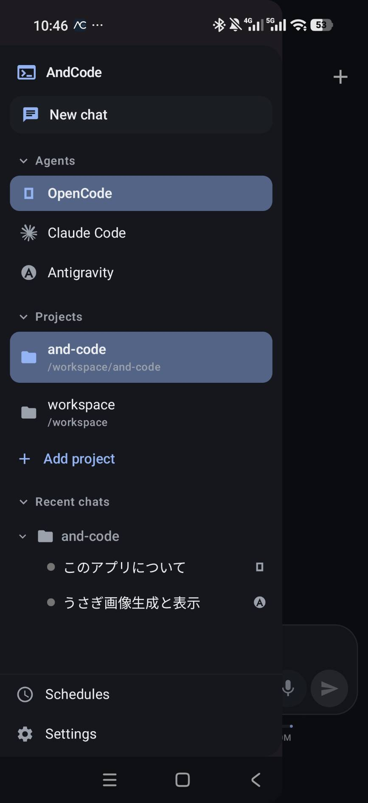
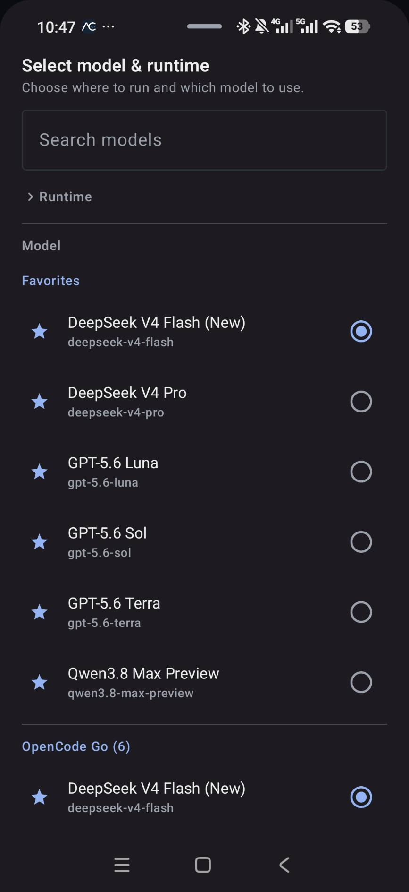
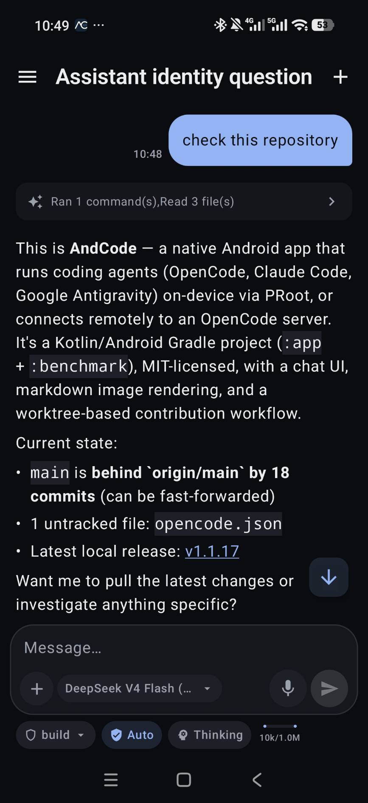
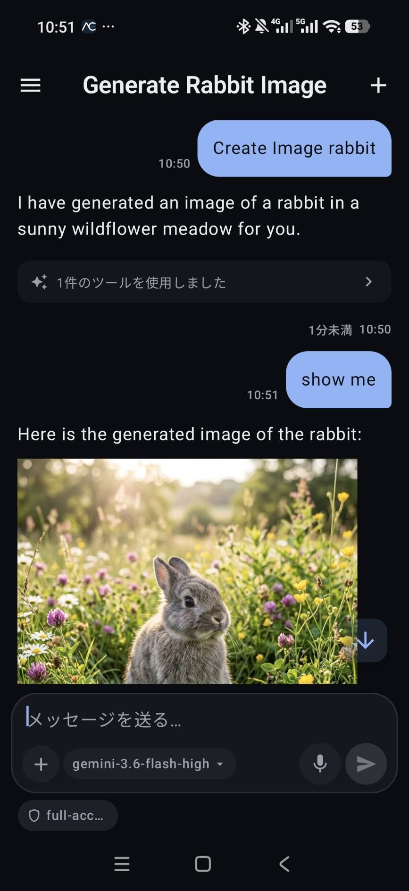
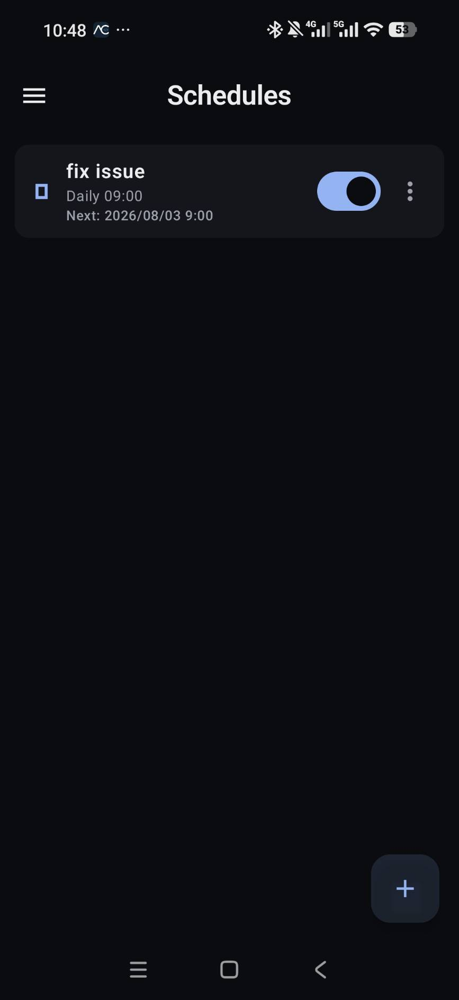
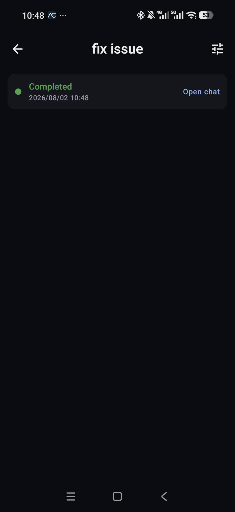

# AndCode

<p align="center">
  <a href="https://github.com/yuga-hashimoto/and-code/actions/workflows/android.yml"></a>
  <a href="https://github.com/yuga-hashimoto/and-code/releases/latest"></a>
  <a href="LICENSE"></a>
  <a href="https://github.com/yuga-hashimoto/and-code/releases/latest"></a>
</p>

**Run coding agents locally on Android through a native GUI — no terminal required.**

AndCode is a native Android GUI app that brings AI coding agents to your phone. Chat with [OpenCode](https://github.com/sst/opencode), [Claude Code](https://github.com/anthropics/claude-code), and [Google Antigravity](https://github.com/google-antigravity/antigravity-cli) through a touch-first interface — no terminal, no SSH, no PC required for on-device use. It wraps agent runtimes via PRoot (on-device) or connects remotely to your existing OpenCode server on PC/Mac/Linux.

[Releases](https://github.com/yuga-hashimoto/and-code/releases/latest) · [日本語のREADME](README.ja.md)

> [!IMPORTANT]
> AndCode is an independent, local-first graphical interface that installs or launches supported third-party command-line tools on the user's own Android device. AndCode itself does not provide or resell the underlying AI services, subscriptions, model access, or account entitlements. Authentication, model access, inference, and provider communication are handled by the applicable official CLI or user-configured provider. AndCode is not affiliated with, endorsed by, sponsored by, or officially supported by OpenCode, Anthropic, or Google. See [Legal & Third-Party Software](#legal--third-party-software) below.

<div align="center">

### Screenshots

<table>
  <tr>
    <td align="center"><br><em>Navigation drawer</em></td>
    <td align="center"><br><em>Model &amp; runtime picker</em></td>
    <td align="center"><br><em>Repository chat</em></td>
  </tr>
  <tr>
    <td align="center"><br><em>Image generation</em></td>
    <td align="center"><br><em>Schedules</em></td>
    <td align="center"><br><em>Run result</em></td>
  </tr>
</table>

</div>

> [!IMPORTANT]
> AndCode is an independent open-source project. It is **not** affiliated with OpenCode, Anthropic, or Google.

---

## Table of Contents

- [Supported Agents](#supported-agents)
- [Features](#features)
- [Antigravity](#antigravity)
- [Remote OpenCode](#remote-opencode)
- [Screens](#screens)
- [Quick Start](#quick-start)
- [Security](#security)
- [On-Device Runtime Details](#on-device-runtime-details)
- [Handoff (Runtime Switching Mid-Conversation)](#handoff-runtime-switching-mid-conversation)
- [Connecting to OpenCode Desktop](#connecting-to-opencode-desktop)
- [Building from Source](#building-from-source)
- [Documentation](#documentation)
- [Contributing](#contributing)
- [Legal & Third-Party Software](#legal--third-party-software)
- [License](#license)

## Supported Agents

| Agent | On-Device | Remote PC | Status |
|-------|:---------:|:---------:|--------|
| [OpenCode](https://github.com/sst/opencode) | ✓ | ✓ | Stable |
| [Claude Code](https://github.com/anthropics/claude-code) | ✓ | — | Beta |
| [Google Antigravity](https://github.com/google-antigravity/antigravity-cli) | ✓ | — | Beta |

On-device agents run inside a Linux environment via PRoot. OpenCode and Claude Code use Alpine Linux; Google Antigravity additionally installs a Debian Bookworm rootfs alongside Alpine, since the official `agy` binary links against glibc.

## Features

- **Native Android GUI** — Touch-first interface for coding agents; no CLI or terminal required for day-to-day use
- **On-device runtime** — Alpine Linux, Git, bash, curl, ripgrep, and coding agents auto-installed on your Android device via PRoot
- **Repository & workspace** — Open git repositories on-device, browse the file tree, and view files with syntax highlighting
- **Device files** — Grant all-files access and the whole phone (`/sdcard`, SD cards, USB drives) becomes browsable in the folder picker and reachable by the agent, opened in place instead of copied into the app
- **Git support** — Browse status and review diffs from the GUI; use the embedded runtime terminal for other Git operations
- **Diff viewer** — Review code changes inline before accepting
- **Embedded terminal** — Run bounded shell commands inside the on-device runtime
- **Pull request badges** — Pull requests opened in a chat stay pinned above the composer with their diff size and state (draft, open, conflict, merged, closed); tap to open them on GitHub
- **Tool approvals** — Approve or reject dangerous tool operations
- **Session management** — Create, resume, rename, and delete sessions
- **Scheduled tasks** — Run prompts automatically on a one-time or recurring (cron) schedule, with run history
- **Dynamic models** — Models, providers, and agents fetched live from your connected agent instance
- **Real-time streaming** — SSE-based live responses, tool execution, and approval requests
- **Structured timeline** — Collapsible reasoning, tool calls, and command output
- **Voice + Wake Word** — Push-to-talk with Android speech recognition + wake word detection
- **Text-to-speech** — Read responses aloud
- **Digital assistant** — Register as Android's default assistant (home gesture / corner swipe)
- **Home screen widget** — Fire off a prompt straight from the launcher without opening the app first
- **Secure storage** — Connection credentials encrypted with Android Keystore
- **Localized UI** — English, Japanese, Chinese (Simplified), Russian, Spanish, French, Portuguese (Brazil), and Arabic, switchable from Settings

## Antigravity

Google Antigravity (`agy`) runs on-device inside the same PRoot environment. Unlike OpenCode and Claude Code which run in Alpine Linux, Antigravity uses a Debian Bookworm rootfs for glibc compatibility with the official CLI binary.

- **OAuth sign-in** — Authenticate via the browser URL + one-time code flow; credentials are stored only in the Linux rootfs (`~/.gemini`), never in Android preferences
- **Model selection** — Live model catalog fetched from the signed-in `agy` instance (Gemini, Claude, GPT-OSS variants)
- **Permission modes** — Three-tier control: Plan, Accept Edits, and Full Access (`--dangerously-skip-permissions`)
- **MCP servers** — Read/write `~/.gemini/config/mcp_config.json` directly, matching the official CLI's config format
- **Sandbox launcher** — PTY-based process with explicit terminal geometry; `AGY_CLI_DISABLE_AUTO_UPDATE=1` keeps updates app-controlled

## Remote OpenCode

In addition to on-device agents, AndCode can connect to OpenCode running on your PC/Mac/Linux as an additional feature:

- **Remote connection** — Connect over LAN or Tailscale
- **Runtime switching** — Seamlessly switch between local and remote execution, even mid-conversation (handoff)
- **Discovery** — Find PCs via QR code or mDNS (zero-config LAN discovery)

## Screens

| Screen | Description |
|--------|-------------|
| Chat | Home screen and conversation view — recent sessions, collapsible reasoning/tools, voice input, model switching, approvals, handoff |
| Workspaces | Local runtime setup, PC connections, working folders, file browser, code viewer, embedded terminal |
| Schedules | Create, edit, enable/disable, and review the run history of one-time or recurring (cron) prompts |
| Settings | Agents & providers, GitHub, MCP servers, model visibility, voice/TTS, digital assistant, language |

## Quick Start

### Option A: On-Device (no PC needed)

1. Install the APK from [Releases](https://github.com/yuga-hashimoto/and-code/releases/latest)
2. Open the app → tap **Workspaces** → **This Android device** → **Set up on this device**
3. Wait for the runtime to download and install (~2 min on a good connection)
4. Select your coding agent and start chatting

### Option B: Remote PC

1. Start OpenCode on your PC:

```bash
OPENCODE_SERVER_PASSWORD='your-strong-password' \
  opencode serve --hostname 0.0.0.0 --port 4096 --mdns
```

2. Install the APK on your Android device
3. Open the app → **Workspaces** → **Add connection**
4. Enter your PC's IP (or use **LAN search** / **QR code** for auto-discovery)

```text
Name:     Mac mini
URL:      http://192.168.1.10:4096
Username: opencode
Password: your-strong-password
```

> Tailscale works too: `http://100.x.y.z:4096` or `http://your-mac.tailnet-name.ts.net:4096`

### QR Code Setup

Generate a QR code on your PC:

```bash
npx qrcode "opencode://connect?name=Mac%20mini&url=http%3A%2F%2F192.168.1.10%3A4096&username=opencode&password=your-password&insecure=true"
```

Then scan it from **Workspaces** → **Add via QR** in the app.

## Security

- **Never** expose port 4096 directly to the internet
- Use LAN or Tailscale for connectivity
- Use an HTTPS reverse proxy on public networks
- The app never auto-approves dangerous operations
- Plaintext HTTP on LAN requires explicit per-connection opt-in
- PRoot is a compatibility runtime, not a full security sandbox. Full-access / bypass-permissions modes let the official CLI run commands and edit files without asking; the app warns before you turn one on, but you should still back up important files and only point an agent at repositories, prompts, and MCP servers you trust
- QR codes generated for the `opencode://connect` flow can embed a plaintext connection password — only scan codes from a source you trust, and treat a printed/displayed QR code the same as sharing that password

## On-Device Runtime Details

The setup process (triggered from Workspaces):

1. Verifies the native PRoot runner bundled in the APK
2. Downloads Alpine Linux minirootfs from the official CDN
3. Downloads the agent binary from GitHub Releases
4. Validates SHA-256 checksums for both
5. Extracts to a private app directory
6. Installs Git, bash, curl, ripgrep, and CA certificates inside Alpine
7. Starts the agent server on `127.0.0.1:4097`
8. Switches the app to the local runtime

Pinned versions (updatable via app releases without agent changes; see [`local-runtime-manifest.json`](app/src/main/assets/local-runtime-manifest.json)):

- Alpine Linux 3.24.1
- OpenCode 1.18.5
- Google Antigravity CLI 1.1.7 (Debian Bookworm rootfs)
- Architectures: arm64-v8a, x86_64

## Handoff (Runtime Switching Mid-Conversation)

From the chat header menu → **Continue on another runtime** — the app generates a conversation summary prompt and sends it to the selected runtime, letting you pick up where you left off (e.g., start on-device while commuting, continue on your PC at home).

## Connecting to OpenCode Desktop

Add server config to `~/.config/opencode/opencode.json`:

```json
{
  "server": {
    "port": 4096,
    "hostname": "0.0.0.0",
    "mdns": true
  }
}
```

Restart the desktop app, then discover it from the Android app via **LAN search**.

## Building from Source

Requirements: JDK 17, Android SDK, Python 3, network access (first build only)

```bash
./gradlew detekt spotlessCheck :app:lintGithubDebug :app:testGithubDebugUnitTest :app:assembleGithubDebug :app:assembleGithubRelease
```

Output APKs:

```text
app/build/outputs/apk/github/debug/app-github-debug.apk
app/build/outputs/apk/github/release/app-github-release-unsigned.apk
```

Install to device:

```bash
adb install -r app/build/outputs/apk/github/debug/app-github-debug.apk
```

## Documentation

- [On-Device Runtime Design](docs/LOCAL_RUNTIME.md)
- [Antigravity Local Runtime](docs/ANTIGRAVITY.md)
- [Antigravity Agent Parity Design](docs/superpowers/specs/2026-07-27-antigravity-agent-parity-design.md)
- [CI Guide](docs/CI.md)
- [Release Guide](docs/RELEASE.md)
- [Translation Guide](docs/TRANSLATION.md)
- [Device Validation Matrix](docs/device-matrix.md)

## Contributing

Contributions are welcome — code, bug reports, and translations! Please see [CONTRIBUTING.md](CONTRIBUTING.md) for setup and workflow, and [docs/TRANSLATION.md](docs/TRANSLATION.md) if you'd like to help translate the app.

## Legal & Third-Party Software

- **Official CLIs run on-device.** OpenCode, Claude Code, and Google Antigravity are the official, unmodified binaries from their respective projects, downloaded from their official distribution channels and executed inside the PRoot Linux environment on your device (or, for OpenCode, on your own PC/Mac/Linux machine). AndCode does not fork, patch, or re-implement their agent logic.
- **You bring your own account or API access.** AndCode does not sell, resell, or otherwise provide Claude, Antigravity, OpenCode-model, or GitHub access. You authenticate with your own account or provider configuration, subject to that provider's current terms of service.
- **AndCode does not relay prompts or tokens through its own servers.** There is no AndCode backend that prompts, files, or OAuth tokens pass through. Requests go directly from the on-device CLI (or your PC's OpenCode server) to the provider you configured. See [docs/AUTHENTICATION_AND_DATA_FLOW.md](docs/AUTHENTICATION_AND_DATA_FLOW.md).
- **OAuth tokens are not reused across tools.** Claude Code and Antigravity each keep their own OAuth credentials inside the Linux/Debian rootfs the way their official CLI normally would; AndCode never copies them into Android app settings, another agent's credential store, or an external service.
- **See also:** [PRIVACY.md](PRIVACY.md), [TERMS.md](TERMS.md), [THIRD_PARTY_SERVICES.md](THIRD_PARTY_SERVICES.md), [TRADEMARKS.md](TRADEMARKS.md), and [THIRD_PARTY_NOTICES.md](THIRD_PARTY_NOTICES.md) (OSS licenses for bundled runtime components and dependencies). All of these are also reachable offline from **Settings → Legal & Privacy** in the app.

Runtime generation reuses generic Termux package resolution/extraction logic redesigned for coding agents, inspired by the MIT-licensed Hermes Agent Android implementation. See [THIRD_PARTY_NOTICES.md](THIRD_PARTY_NOTICES.md) for the full list of bundled third-party components and their licenses.

## License

The **AndCode source code** in this repository is [MIT licensed](LICENSE). That license covers AndCode's own Kotlin/Android code only — it does **not** extend to the third-party CLIs, runtimes, or packages AndCode installs or launches (Claude Code, Google Antigravity, OpenCode, PRoot, Alpine/Debian packages, and others), each of which is distributed under its own upstream license. See [THIRD_PARTY_NOTICES.md](THIRD_PARTY_NOTICES.md) and [TRADEMARKS.md](TRADEMARKS.md).
